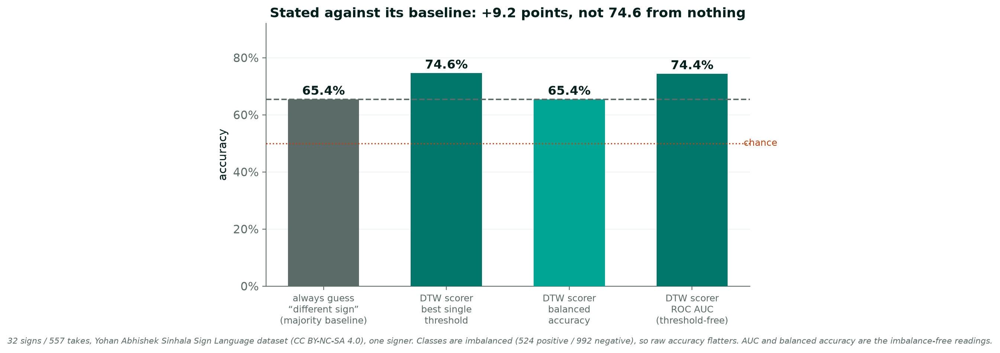
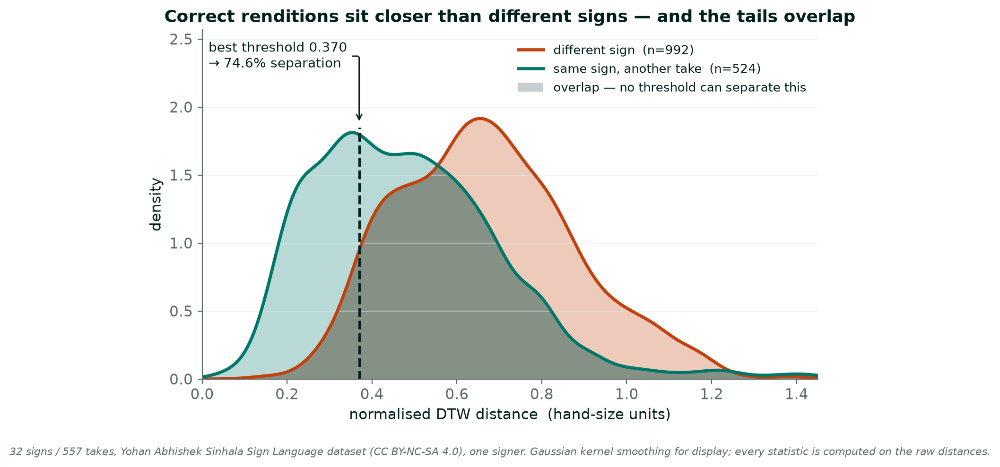
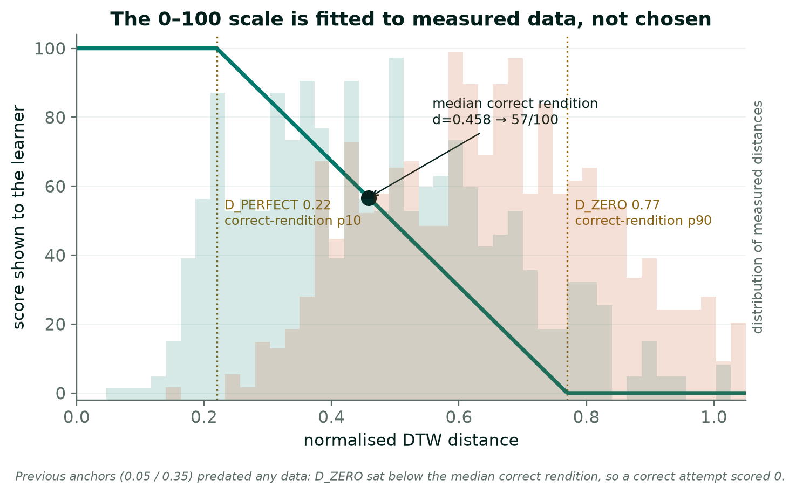
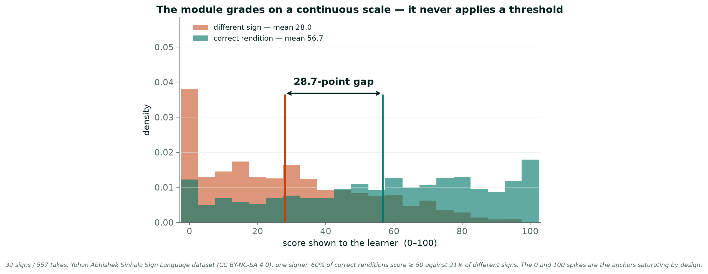
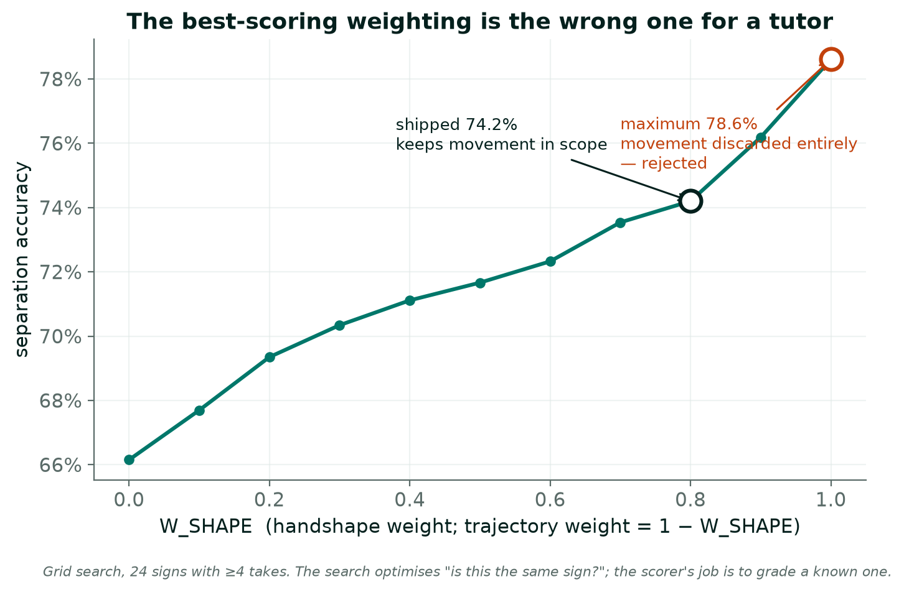
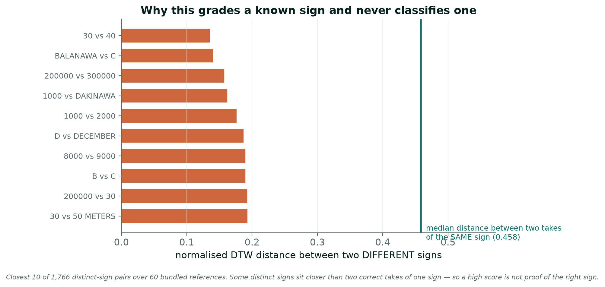
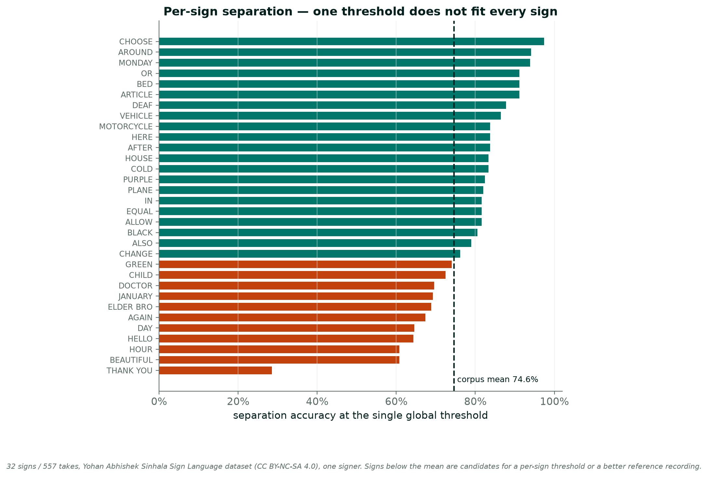
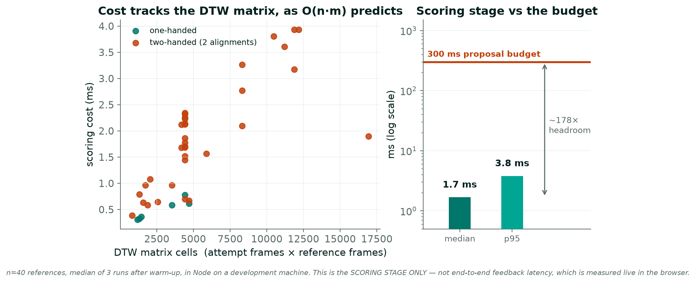

# Evaluation of the SSL Learning & Practice Module

**Component 4 of R26-SE-019 (*Suvana*)** — Ranathunga R A K N, IT22552860
Measurements re-run 31 August 2026 against commit `2d85c78`.

This document reports what has been measured, what has not, and why each metric
was chosen. Reproduction commands: [EVIDENCE.md](EVIDENCE.md) §4.

---

## 1. What is being evaluated

The module asks a learner to perform a **specified** SSL sign, captures their
hands in the browser (MediaPipe HandLandmarker, 21 landmarks per hand), and
compares the resulting landmark sequence to a reference recording of the same
sign by a real signer using **Dynamic Time Warping**. It returns a 0–100 score,
a per-hand breakdown, per-joint deviations and corrective text.

**It grades a known sign. It does not classify an unknown one.** That
distinction governs every metric below, and §6 gives the measured evidence for
why it must be maintained.

### Evaluation data

| | |
|---|---|
| Corpus | Yohan Abhishek SSL video dataset, **CC BY-NC-SA 4.0** (non-commercial) |
| Calibration set | **557 takes** across **33 signs** (32 usable — one has a single take) |
| Signers | **1** |
| Positive pairs | 524 — take *i* vs take 0 of the same sign |
| Negative pairs | 992 — take 0 of one sign vs take 0 of a different sign |
| Shipped reference library | **501 recordings, 490 distinct glosses** (141 Kaggle CC0 + 360 Yohan) |

**The corpus labels itself.** Two takes of one sign by one signer are a correct
rendition performed twice; takes of different signs are a wrong-sign attempt. No
human annotation is involved, and none is claimed.

---

## 2. Headline results

| Metric | Value |
|---|---|
| **ROC AUC** (threshold-free, imbalance-free) | **0.744** |
| Majority-class baseline | 65.4% |
| Best single-threshold accuracy | 74.6% at distance 0.370 (**+9.2 points over baseline**) |
| Balanced accuracy at that threshold | 65.4% (TPR 0.357, FPR 0.048) |
| **Operational score gap** (correct − different) | **28.7 points** (56.7 vs 28.0) |
| Correct renditions scoring ≥ 50 | 60.5%, against 20.7% of different signs |
| Scoring-stage cost | median **1.8 ms**, p95 **12.6 ms** (n = 40) against a 300 ms budget |

**Read the headline this way, not as "74.6% accuracy".** The evaluation set is
imbalanced 524:992, so a model that always answered *"different sign"* would
score 65.4%. Raw accuracy flatters under that imbalance; AUC and balanced
accuracy are the readings that do not.

---

## 3. Score-scale calibration

| pair | n | mean | p10 | median | p90 |
|---|---|---|---|---|---|
| same sign, another take | 524 | 0.483 | **0.222** | 0.459 | **0.767** |
| a different sign | 992 | 0.669 | 0.405 | 0.662 | 0.954 |

The two populations separate, and their tails overlap. The overlap is the
finding, not a flaw to be hidden: it is exactly the 25.4% that no single
threshold can resolve, which is one reason the product does not use one.

### The distance → score map is fitted, not chosen

`D_PERFECT` = **0.22** and `D_ZERO` = **0.77** are the **p10 and p90 of the
measured correct-rendition distribution**. The best tenth of correct renditions
score 100; the worst tenth score 0; a median correct rendition lands at 57.

The previous anchors were 0.05 / 0.35, assumed before any data existed. `D_ZERO`
sat *below* the median correct rendition — **a genuinely correct attempt scored
zero.** Calibration was corrective, not decorative.

---

## 4. What the learner actually experiences

The shipped system applies **no threshold**. It maps distance to a continuous
0–100 score. On that axis:

| | mean | median | ≥ 50 |
|---|---|---|---|
| correct rendition | **56.7** | 60 | 60.5% |
| different sign | **28.0** | 24 | 20.7% |

A **28.7-point** mean separation. This is the operationally meaningful result:
it describes the signal a learner receives, whereas the threshold accuracy in §2
describes a classifier the product does not contain.

---

## 5. Feature weighting — fitted, and deliberately not maximised

`W_SHAPE` / `W_TRAJ` weight handshape against movement in the per-frame
distance, constrained to sum to 1. A grid search over 11 weightings on 24 signs
(≥ 4 takes each):

| W_SHAPE | 0.0 | 0.2 | 0.4 | 0.6 | **0.8** | 0.9 | **1.0** |
|---|---|---|---|---|---|---|---|
| separation | 66.2% | 69.3% | 71.1% | 72.3% | **74.2% ← shipped** | 76.2% | **78.6% ← maximum** |

Separation rises monotonically and peaks at `W_SHAPE` = 1.0 — **discarding
movement entirely**.

**That maximum was rejected.** The search optimises *"is this the same sign?"*,
a classification objective; this scorer *grades a known sign*. Movement is a
phonological parameter of SSL, and a scorer blind to it would award full marks
to a learner with the correct handshape and the wrong movement. The shipped
value takes the measured gain up to 0.8 and stops there.

Two further changes were measured and reverted:

| Change | Effect | Verdict |
|---|---|---|
| Sequence-stable hand-size scaling | 73.7% → 73.4% | No effect; reverted |
| Trajectory as velocity, not centred position | 73.5% → **75.5%** | **Reverted despite winning** — a unit test showed a learner moving in entirely the wrong direction still scored 100 |

Each is a result, not a dead end: the constants are now measured rather than
assumed, and one measured improvement was declined for a stated reason.

---

## 6. A grader, not a classifier — the evidence

Over **1,766 distinct-sign pairs** from 60 bundled references, the closest sit
at:

| pair | distance |
|---|---|
| `30` vs `40` | **0.135** |
| `BALANAWA` vs `C` | 0.140 |
| `200000` vs `300000` | 0.157 |

The median distance between two takes of the **same** sign is **0.458** — so
some genuinely different signs sit closer together than two correct takes of one
sign typically do.

**A high score is therefore not proof the right sign was made.** This is why the
scenario rubric's *appropriateness* component compares only within a scenario's
small vocabulary rather than across all 490 references: a bounded closed-set
judgement is meaningful where an open-set one would not be.

---

## 7. Per-sign behaviour

One global threshold does not fit every sign. At the single global cut-off:

- best — `CHOOSE` 97%, `AROUND` 94%, `MONDAY` 94%
- worst — `THANK_YOU` **29%**, `BEAUTIFUL` 61%, `HOUR` 61%

`THANK_YOU` is a clear outlier and worth understanding rather than averaging
away: it indicates either a per-sign threshold is needed, or that this sign's
reference recording is poor. Both are actionable, and this chart is how they
became visible.

---

## 8. Latency

### Operational definition

The clock starts at the **capture of the final frame of the attempt** and stops
when the **corrective feedback has been painted**.

**Excluded, because JavaScript cannot observe them:** the camera's sensor→browser
delay, and the display's response time after painting. Every figure is therefore
a *software pipeline* latency and is quoted as such, never as glass-to-glass.

The measurement **errs high** in two places, which is the safe direction for an
"under 300 ms" claim: the take ends on whichever frame arrived last (up to one
frame interval, ~33 ms at 30 fps), and the paint mark is taken at the frame
boundary *after* the paint. Samples taken while the tab is backgrounded are
discarded, since `requestAnimationFrame` throttling there would measure the tab
being hidden rather than the app being slow.

### Results — scoring stage

| Path | n | median | p95 | max |
|---|---|---|---|---|
| Practice — one attempt vs one reference | 40 | **1.8 ms** | 12.6 ms | 21.5 ms |
| Scenario turn — plus appropriateness over 5 signs | 5 | 11.1 ms | 40.6 ms | 40.6 ms |

Cost tracks the DTW matrix as O(n·m) predicts. The attempt side is the larger
factor: a learner records for `reference duration + 1500 ms` at ~30 fps, giving
a median 114-frame attempt against a median 32-frame reference. 33 of the 40
sampled references are two-handed, which runs two alignments. A participant on a
60 fps webcam doubles the attempt-side length and with it this cost — still two
orders of magnitude inside budget.

> **One caveat on this table.** These are the committed figures from
> `latency-report.md`, which was produced deliberately on an idle machine — the
> conservative reading, and the one to quote. It was, however, generated when
> the library held **362** references rather than today's 501, so its sample
> description is slightly stale. An incidental re-run on 31 Aug 2026 over the
> current 501-reference library gave median **1.7 ms** / p95 **3.8 ms** — the
> same median, a lower tail, because tail timing tracks CPU contention. See
> [EVIDENCE.md](EVIDENCE.md) §6 for the one command that refreshes it.

### What this figure is not

It is **the scoring stage only**. It excludes landmark inference on the final
frame, React's commit and the browser's paint, and it runs in Node on a
development machine rather than in a participant's browser.

End-to-end feedback latency **is** instrumented — `useFeedbackLatency.ts`
measures the whole path live and the Progress tab reports median, p95 and share
within 300 ms. It requires **~20 real attempts** before its 95th percentile is
more than "the second slowest one". Producing those is roughly an hour of
signing and is the last thing standing between "instrumented" and "measured".

---

## 9. Status against the proposal targets

| Target | Status | What exists |
|---|---|---|
| **≤ 300 ms feedback latency** | **Met for the scoring stage; end-to-end instrumented** | 1.8 ms median measured; live instrument built and reporting |
| **≥ 90% feedback accuracy vs expert** | **Not measured** | Proxy reported (AUC 0.744 / +9.2 over baseline). Needs learner attempts graded by an SSL teacher |
| **≥ 20% learning gain after 10 sessions** | Instrumented, not measured | Attempts carry a `sessionId`, so "after N sessions" is countable rather than inferred |
| **SUS ≥ 70** | Not measured | Needs the pilot **and** a questionnaire that does not yet exist |

One of four measured; one has a stated proxy; two depend on the pilot study
running September–October.

---

## 10. Limitations

Stated here rather than waited for.

1. **One signer in the calibration corpus.** The measured spread is the natural
   variation of one fluent person — narrower than a learner's. Every constant
   fitted from it is therefore **optimistic**. This establishes where the score
   scale should sit; it does not substantiate a grading-accuracy claim.
2. **No expert-graded learner attempts**, so the ≥90% target has a proxy and not
   a result.
3. **No Deaf validation of the references.** The corpora are public and
   performed by real signers, but nothing in the library has been reviewed by a
   Deaf signer for this project. The agreed fix is references recorded with a
   teacher at the School for the Deaf, Ratmalana.
4. **Non-manual markers are not scored.** The build tracks hands only, so facial
   expression, head tilt and body movement are not captured. Their 10% is
   reallocated to accuracy (50/30/20), documented in the source, the README and
   the app's own UI. Reporting a number for them would be fabricating one.
5. **Fluency is whole-clip pace only.** It does not assess rhythm within a sign,
   or holds and transitions.
6. **Appropriateness is a closed-set judgement.** It detects confusion only with
   signs the library holds, and sharpens as the library grows.
7. **Landmark skeletons are a weak reference presentation.** A skeleton cannot
   convey palm orientation or fine handshape. Mitigations shipped; video
   references are the agreed fix, deferred.
8. **Continuous, co-articulated signing is not evaluated.** Phrases are scored
   sign-by-sign plus a phrase-level fluency metric. Explicit future work.
9. **Zero pilot participants to date.**

---

## 11. Next

In priority order, driven by what unblocks the most:

1. **Recruit pilot participants** — two targets depend on it and recruitment has
   lead time nothing else can absorb. Even 5 gives real numbers.
2. **Prepare the SUS instrument** — the standard 10 items. No code required; it
   simply does not exist yet.
3. **Produce end-to-end latency figures** — ~20 scored attempts, then read the
   Progress tab.
4. **Freeze the UI from the first participant.** SUS scores a *system*; if P01
   rates one build and P05 another, the mean describes nothing that exists. A
   mid-study UI change is also indistinguishable from learning, which confounds
   the learning-gain measurement. Participants are pinned to a specific
   deployment URL, not the moving production alias.
5. **Record signer-validated references** with a teacher at the School for the
   Deaf — the change with the highest ceiling, since reference quality bounds
   everything the scorer can do.
